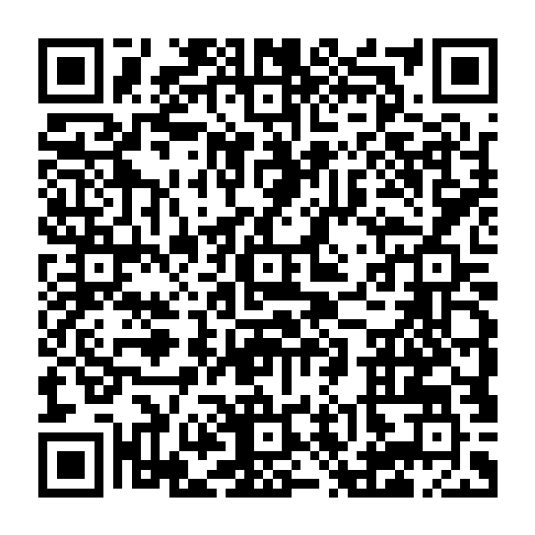
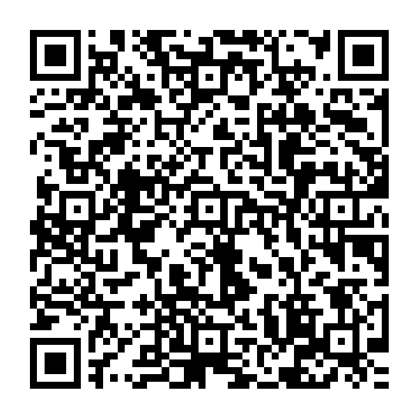

+----------------------------------------------------+--------------------------------------------+
| ## Find the wine that makes the moment             | ## Making Wine — [May topic]               |
|                                                    |                                            |
| People ask me how to pick a wine, and they expect  | [ MAY MAKING WINE PLACEHOLDER — Evyatar's  |
| me to talk about regions. Honestly? Regions matter | first-person note on what's happening in   |
| less than context.                                 | the vineyard and the winery in May.        |
|                                                    | Replace with the edited May section from   |
| Look at three things: the weather, the food, and   | the 12-month draft once ready. Personal,   |
| the people.                                        | conversational, 3–5 short paragraphs.      |
|                                                    | Title topic gets filled in based on the    |
| A warm afternoon calls for brightness — a          | entry's actual subject (e.g., "Making      |
| high-acidity white or rosé that drinks like a      | Wine — Canopy Management"). ]              |
| cooling breeze. A cozy evening wants weight — a    |                                            |
| bolder red that fills the room.                    | ------                                     |
|                                                    |                                            |
| With rich, savory food, pick a wine intense        | **Special offers by email, and             |
| enough to hold its own. With light and fresh       | fascinating information about the world    |
| dishes, pick something with acidity to keep the    | of wine.**                                 |
| meal feeling lively.                               |                                            |
|                                                    | {width=3cm} |
| Not sure about your guests' tastes? Medium         |                                            |
| complexity is your friend — interesting enough to  | jlmwines.com                               |
| enjoy, approachable enough for everyone. Wine      |                                            |
| people coming over? A more complex bottle gives    |                                            |
| them something to talk about.                      |                                            |
|                                                    |                                            |
| There are no wrong answers, only different         |                                            |
| moments. Match the wine to the moment, and you'll  |                                            |
| get it right.                                      |                                            |
|                                                    |                                            |
| If you'd rather just ask, I'm here. Tell me about  |                                            |
| the food, the guests, and the mood — I'll help.    |                                            |
|                                                    |                                            |
| *— Evyatar*                                        |                                            |
|                                                    |                                            |
| ------                                             |                                            |
|                                                    |                                            |
| **Read the full article**                          |                                            |
|                                                    |                                            |
| {width=3cm}        |                                            |
|                                                    |                                            |
| jlmwines.com/context                               |                                            |
+----------------------------------------------------+--------------------------------------------+
